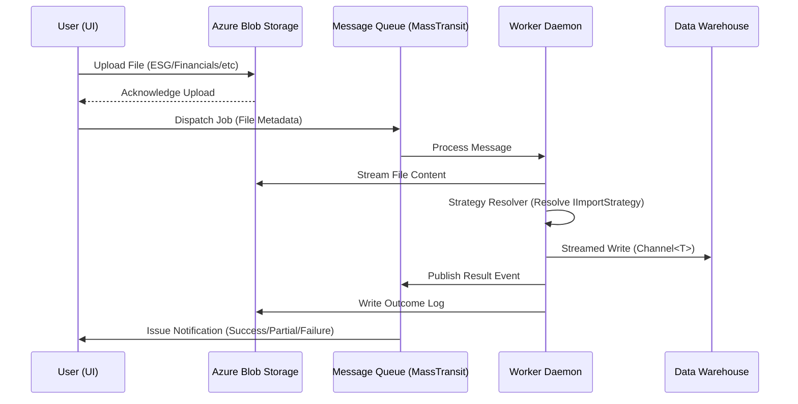
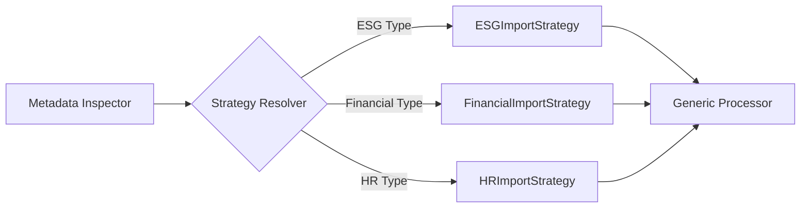

# BYOD: Technical Findings

The "Bring Your Own Data" (BYOD) platform was designed as a **forward-looking architecture** to eliminate the manual 
ETL (Extract, Transform, Load) bottleneck. The key challenge was building a system that could handle any dimension 
in a STAR schema while maintaining a simple user experience.

## Strategy Resolver Pattern

The heart of the BYOD engine is the **Strategy Resolver pattern**. 

- **Problem:** I didn't want a massive `switch` statement that needed to be updated every time a new data type was 
  added. That's a "maintenance debt" trap that only grows over time.
- **Solution:** I implemented a system that inspects the metadata of the uploaded file and resolves the appropriate 
  `IImportStrategy` at runtime.
- **Extensibility:** Adding support for a new data type (like ESG, Invoices, Suppliers, etc.) only requires 
  implementing a new strategy class. The core engine remains untouched—**Open-Closed Principle** in action.

## Durable Job Dispatch (MassTransit)

To ensure I didn't lose data during processing, I used a **decoupled job dispatch** system using **MassTransit** over 
**RabbitMQ** and **Azure Service Bus**.

- **Resilience:** If the processing engine goes down, the message stays in the queue. No more "the server rebooted 
  and I lost my upload" support tickets at 3 AM.
- **Scalability:** I can spin up multiple instances of the Unix daemon to consume messages from the queue during 
  peak upload periods.

## Blob Storage Staging

Files are never processed directly from the web server. Instead, I use **Azure Blob Storage** for staging.

1.  **Upload:** The user uploads the file to a secure blob container.
2.  **Notification:** An event is triggered that pushes a message into the queue.
3.  **Processing:** The background worker pulls the file from blob storage, processes it, and writes the log file 
    back to the same container.

This approach keeps the web servers thin and stateless, reducing the **operational burden** of scaling the front-end 
independently from the processing heavy-lifters.

## Streaming Load Stages (`Channel<T>`)

Similar to the [Intelligence project](../intelligence/technical-findings.md#channels-for-buffered-handoff), I used 
`System.Threading.Channels` to stream data through the load stages.

This allows me to buffer and start processing the rows while the rest of the file is still being read from blob storage.

The ingestion path was also designed with memory materialisation in mind. By using the Sep library and 
`ReadOnlySpan<T>`-based parsing, the processor could operate over slices of existing buffers rather than repeatedly 
allocating strings or intermediate objects on the heap. This reduced GC pressure and kept the hot path efficient while 
rows moved through the buffered `Channel<T>` pipeline.

In a world of multi-gigabyte CSVs, "Load to List" is a suicide mission. Streaming is the only responsible way to 
build an ingestion engine.

A key consideration in this design was being intentional about data materialisation. Understanding when data is 
allocated, copied, buffered, or streamed has a direct impact on memory pressure, throughput, and overall system performance.

---

For the project's human-centric insights, see the [Lessons Learned](lessons-learned.md).
