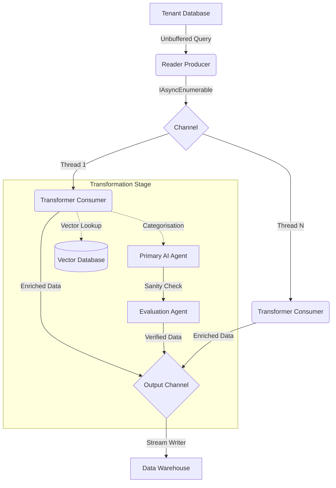

# Intelligence: Technical Findings

This document dives into the "guts" of the anonymous benchmarking analytics pipeline.
I prioritised **low-latency streaming** and **deterministic anonymisation** to handle hundreds of millions of rows 
without blowing up the infrastructure budget.

> _**Disclaimer**: To protect intellectual property, findings are not identical to true implementation but should reveal
> enough technical details to demonstrate key points._

## Streaming Architecture

When you're dealing with massive data volumes, loading everything into memory is a non-starter or a sure-fire way to 
set fire to your local development machine, or more likely, just going out-of-memory (OOM).

I needed to weigh up the pros and cons of batching, chunking, and streaming strategies.

Ultimately, batching and chunking into a multi-stage processing pipeline would still involve storing large volumes of 
data on the heap, processing them, and performing garbage collection, all of which are expensive and would likely 
cause deployment pipelines to run out of resources.

Instead, I built this as a **streaming-first pipeline**, where data is constantly in motion and never fully 
materialised unless strictly necessary.

### Unbuffered Queries

I leveraged Dappers ability to execute **unbuffered queries**.

By avoiding the materialisation of large collections in memory, I kept the process memory footprint stable at ~750MB,
regardless of whether I was processing 10 thousand or 100 million records.

_That may sound slightly on the higher side, but I was materialising the lookup dimensions with in-memory hash-based 
indexes, more on that [here](#o1-binary-search-and-hash-based-indexing)._

*Performance Note:* While this keeps memory usage low, it does keep the database connection open longer.
To mitigate transient failures during this time, I implemented a resilience pipeline wrapping the database 
connection.

### Asynchronous Enumeration (`IAsyncEnumerable<T>`)

The core of the pipeline is built around `IAsyncEnumerable<T>`. 
This allows for **composable, lazy asynchronous data iteration**. 

- **Benefits:** It allows me to apply transformations (like AI classification) as the data is being streamed, rather 
  than waiting for a full batch to complete.
- **Poka-yoke:** `WithCancellation` ensures that if the pipeline is shut down, I don't leave zombie database 
  connections or partially processed records.

See an example of this in action [here](examples/AsyncEnumerationExample.cs).

### Channels for Buffered Handoff

The pipeline follows a **Producer-Consumer pattern** implementing `System.Threading.Channels`.
This is critical for **buffered handoff** between different stages of the pipeline:

1.  **Reader (Producer):** Streams data from the source database into a `Channel<T>`.
2.  **(n) Chained Transformers (Consumer/Producer):** Picks up records, performs a transformation, and pushes to the 
    next `Channel`.
3.  **Writer (Consumer):** Streams the anonymised data to the data warehouse.

This decoupled architecture allows me to saturate the local CPU/Network by letting the Reader stay ahead of the 
(slower) Transformer.
I used `BoundedChannelOptions` with a `FullMode.Wait` to ensure I didn't overwhelm memory if the Transformer hit a 
bottleneck.

## Performance Optimisation

### O(1) Binary Search and Hash-based Indexing

For collecting the anonymised data, I needed to be able to model the tenants’ data to new canonical dimensions in a 
STAR schema.

Doing this in the database would require a lot of processing overhead on the full table and multiple reads and 
lookups with an almost incomprehensible query plan. Instead, I decided to materialise the relatively small dimensions 
onto the heap with hash-based indexes for lightning-fast lookups.

### Vector Embeddings & Semantic Search

For mapping tenant data to canonical dimensions, I initially considered fuzzy searching. However, the 
computational cost of Levenshtein distance at scale is prohibitive. 

Instead, I implemented a **Semantic Search** layer using **Vector Embeddings**. 

- **Embedding Generation:** I used specialised models to project text descriptions into high-dimensional 
  vector space.
- **Vector Database:** I utilised a vector database for O(log n) similarity searches. This allowed me to 
  perform "fuzzy" matches with mathematical precision and lightning speed, even across millions of dimension 
  members.
- **Why this matters:** It moved the problem from "string manipulation" to "coordinate geometry," which is 
  far more scalable.

### The Evaluation Agent Pattern

To combat the inherent non-determinism of LLMs, I didn't just rely on a single prompt. I built a 
**Multi-Agent Evaluation Pipeline**.

1.  **Primary Agent:** Responsible for the initial categorisation or enrichment.
2.  **Evaluation Agent:** A second, more restricted agent that receives the input and the primary agent's 
    output. Its job is to validate the decision against strict business rules and logical constraints.

This pattern acts as a circuit breaker for "hallucinations." If the Evaluation Agent flags a mismatch, the 
record is either rerouted for a deeper model pass or flagged for manual review, ensuring high 
**factual integrity** in the final dataset.

- **Hash-based Indexing:** I used `Dictionary<TKey, TValue>` for exact matches, giving me O(1) lookup performance.
- **O(1) Binary Search:** For range-based lookups or sorted collections, I implemented binary search over pre-sorted 
  arrays.
- This reduced my lookup overhead from milliseconds to nanoseconds. When you're processing 100M rows, a 1ms lookup is 
  27 hours of just waiting. O(1) is the only way to survive.

### Concurrent Coroutine Marshalling

To parallelise the transformation stages, I used **concurrent coroutine marshalling**.
By spawning multiple workers to consume from the Channels, I was able to process records in parallel without the 
overhead of complex lock-management.

## AI Integration

### AI-Assisted Data Enrichment

For category classification where a static crosswalk wasn't enough, I used **artificial intelligence (AI) prompt 
engineering**. 

- **Model Selection:** I targeted small, specialised models for speed.
- **Batching:** I didn't hit the AI for every single row. Instead, I batched requests to reduce the 
  **operational burden** on the inference engine and improve throughput.

## Schema Design: STAR Schema

The final output is written directly into a **STAR schema** data warehouse. 
This was chosen specifically for its query performance in analytics tools. 

- **Fact Tables:** Anonymised expenditure.
- **Dimension Tables:** Categorised taxonomies derived from the AI classification and crosswalk mapping.

---

If you are interested in the human side of this project, check out the [Lessons Learned](lessons-learned.md).
